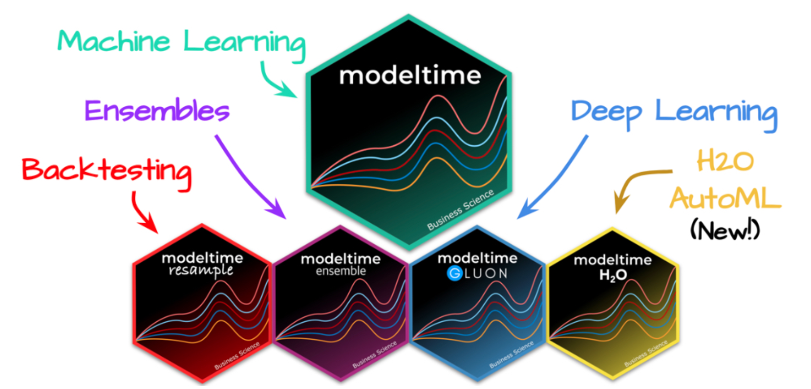
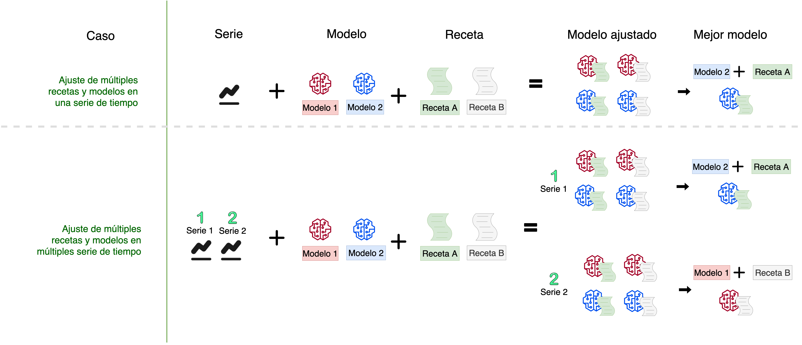

class: center

```{r, out.width='35%', echo=FALSE}
#knitr::include_graphics(c('images/gif_serie.gif'))
```


<br>


# {Sknifedatar}  📦


**Un paquete para el modelado y visualización de múltiples series de tiempo**

<br>

```{r, echo=FALSE, out.width='15%', out.height='15%', fig.align='center'}
knitr::include_graphics('images/logo_latinr.png')
```

<br>
Rafael Zambrano & Karina Bartolomé

Octubre 2022

---


```{r setup, include=FALSE}
knitr::opts_chunk$set(warning = FALSE, 
                      message = FALSE, 
                      comment=FALSE)
```


```{r, echo=FALSE}
library(sknifedatar)
library(modeltime)
library(workflowsets)
library(tidymodels)
library(tidyverse)
library(timetk)
library(anomalize) 
library(lubridate)
library(gt)
```


```{r, echo=FALSE}
xaringanExtra::use_panelset()
options(scipen=999, digits=2)
```


```{css, echo=FALSE}
/* Table width = 100% max-width */
.remark-slide table{width: 100%;}
/* Change the background color to white for shaded rows (even rows) */
.remark-slide thead, .remark-slide tr:nth-child(2n) {
  background-color: white;
  .tfoot .td {background-color: white}
}
.bold-last-item > ul > li:last-of-type,
.bold-last-item > ol > li:last-of-type {font-weight: bold;}
```


```{r, include=FALSE, warning=FALSE}
xaringanExtra::use_progress_bar(color = "#0051BA", location = "top")
```

# ¿Quiénes somos?

.pull-left[
### Rafael Zambrano
- **Actuary / Data Scientist**
]
.pull-right[
<br>
<br>
```{r, out.width='35%', fig.align='center', echo=FALSE}
knitr::include_graphics('images/imagen_b.jpeg')
```
]

.pull-left[
### Karina Bartolomé
- **Economist / Data Scientist**
]
.pull-right[
<br>
<br>
```{r, out.width='35%', fig.align='center', echo=FALSE}
knitr::include_graphics('images/imagen_a.jpeg')
```
]
---

## Ecosistema {tidymodels-modeltime}

{modeltime} fue desarrollado por **Matt Dancho** para realizar análisis de series de tiempo mediante un enfoque ordenado (o Tidy) con {tidymodels} 📦. 

```{r, echo=FALSE, out.height='70%',out.width='90%',  fig.align='center'}

```

---

# Objetivo de la Charla

Presentar el paquete **{skinifedatar}** 📦 para el modelado y visualización de series de tiempo, tomando como caso de uso datos de viajes en transporte público, Argentina (2021-2022). 

Se muestra la compatibilidad con diversos componentes del ecosistema **{tidymodels}** como **{modeltime}**  y **{workflosets}**. 

---

# {sknifedatar} 📦

#### Una extensión de **{modeltime}**

```{r, eval=FALSE}
install.packages('sknifedatar')
```


```{r, echo=FALSE, out.width='25%', out.height='35%', fig.align='center'}
knitr::include_graphics('images/sknifedatar.png')
```

---

# {sknifedatar} 📦

### Funcionalidades

- **Funciones multifit**: Múltiples modelos en múltiples series de tiempo (sin datos de panel)
- **Workflowsets**: Ajuste de múltiples modelos y recetas de preprocesamiento con modeltime
- **Workflowset multifit**: Ajuste de múltiples modelos y recetas de preprocesamiento sobre múltiples modelos (sin datos de panel)
- **Automagic tabs**: Generación automática de tabs
---


# Agenda

#### ✅ Caso de uso
#### ✅ Múltiples modelos en una serie
#### ✅ Múltiples modelos en múltiples series
#### ✅ Múltiples preproc y modelos en múltiples series
#### ✅ Automagic Tabs

---
class: chapter-slide

# Caso de Uso

---

# Caso de Uso

.pull-left[

<br>
<br>
<br>
<br>
<br>
<br>

```{r, out.width='35%', fig.align='center', echo=FALSE}
knitr::include_graphics('https://upload.wikimedia.org/wikipedia/commons/thumb/1/14/SUBE_frente.svg/413px-SUBE_frente.svg.png')
```
]

.pull-right[

<br>


- El **Sistema Único de Boleto Electrónico (SUBE)** es una tarjeta para abonar medios de transporte público en Argentina. 

- Los viajes realizados quedan registrados en un **portal de datos abiertos**. 

- Se busca **proyectar** cómo será el uso de diversas líneas en los próximos días o meses. 


]


---

# Caso de Uso

### Datos 📊

Se utilizan datos de [SUBE - Cantidad de transacciones (usos) por fecha
](https://datos.gob.ar/dataset/transporte-sube---cantidad-transacciones-usos-por-fecha). 

--
```{r}
data <- read_csv('data/df_sube.csv') %>% 
  rename(date=fecha, value=n)
```
--
```{r, echo=FALSE}
data %>% head(4) %>% kableExtra::kable(format = "html")
```

---

# Caso de Uso

* **Evolución de las series 📈**

```{r, fig.width=10, fig.height=5, message=FALSE, eval=FALSE}
data %>% group_by(linea) %>%
  plot_time_series(date, value) 
```

```{r, fig.width=10, fig.height=5, message=FALSE, echo=FALSE}
data %>% group_by(linea) %>%
  plot_time_series(date, value, .interactive=FALSE,
    .facet_ncol = 2, .facet_scales = 'free_y') 
```


---
class: chapter-slide

# Múltiples modelos sobre una serie

---

# Múltiples modelos sobre una serie

* **Seleccion de datos**: Se selecciona el departamento **Ferrocarril Roca** 

```{r, fig.height=3, fig.width=10}
data_ffcc_roca <- data %>% 
  filter(linea=='FFCC ROCA') %>% 
  select(-linea) %>% ungroup()
```


```{r}
data_ffcc_roca %>% head(5) %>% kableExtra::kable(format = "html")
```

---

## Múltiples modelos sobre una serie

* **Partición de datos**: Se particiona el dataset en train y test ✂️

```{r, fig.height=3, fig.width=10}
splits <- data_ffcc_roca %>%  initial_time_split(prop = 0.9)
```


```{r, fig.height=5, fig.width=9}
splits %>% tk_time_series_cv_plan() %>%
  plot_time_series_cv_plan(date, value, .title='Partición temporal') 
```

---

## Múltiples modelos sobre una serie

* **Preprocesamiento / Recetas 🧁**: Se crea una receta de preprocesamiento, incluye la fórmula a estimar y un paso adicional que añade variables en función de la fecha.

```{r}
receta <- recipe(value ~ date, data = training(splits)) %>%
  
  step_date(date, 
            features = c('week', 'month','year','quarter','semester'))
```


```{r, echo=FALSE}
receta %>% prep() %>% juice() %>% head(1) %>% gt()
```


---

## Múltiples modelos sobre una serie

* **Modelos**: Definición y ajuste de modelos sobre train

```{r, eval=TRUE}
# Modelo: Auto-ARIMA
m_autoarima <- arima_reg() %>% 
  set_engine('auto_arima') %>%  
  fit(value~date, data=training(splits))
```


```{r, eval=TRUE}
# Modelo: regresión lineal
m_reg_lineal <- linear_reg() %>%
  set_engine("lm") %>%
  fit(value ~ as.numeric(date) + 
              factor(month(date, label = TRUE), ordered = FALSE)+
              factor(wday(date, label=TRUE), ordered=FALSE),
      data = training(splits))
```

```{r, eval=TRUE}
# Workflow: prophet boosted
m_prophet_boost <- workflow() %>% 
  add_recipe(receta) %>% 
  add_model(prophet_boost(mode='regression') %>%
            set_engine("prophet_xgboost")) %>% 
  fit(data = training(splits))
```

---

## Múltiples modelos sobre una serie

* **Modeltime Table**

El objeto central del ecosistema **{modeltime}** 📦 es el **modeltime_table**, el cual incluye todos los modelos entrenados para realizar comparaciones. 

```{r, eval=TRUE}
modelos <- modeltime_table(m_autoarima,
                           m_reg_lineal,
                           m_prophet_boost
                           )
```

```{r, echo=FALSE, eval=FALSE}
#saveRDS(modelos, 'modelos/modelos_ffcc_roca.rds')
modelos <- readRDS('modelos/modelos_ffcc_roca.rds')
```


```{r, echo=FALSE}
modelos %>% rmarkdown::paged_table(list(rows.print = 6))
```


---

## Múltiples modelos sobre una serie

* **Métricas en Test (Tabla)**

```{r}
calibration_table  <- modelos %>% 
  modeltime_calibrate(new_data = testing(splits))
```

--

```{r, eval=FALSE}
calibration_table %>% 
  modeltime_accuracy()
```

```{r, echo=FALSE}
calibration_table %>% modeltime_accuracy() %>% 
  select(-.type) %>% 
  rmarkdown::paged_table(list(rows.print = 6))
```


---

## Múltiples modelos sobre una serie

* **Métricas en Test (Gráficos)**

```{r}
forecast_series <- calibration_table %>% 
  modeltime_forecast(
    new_data    = testing(splits),
    actual_data = data_ffcc_roca)
```

---

## Múltiples modelos sobre una serie

* **Métricas en Test (Gráficos)**

```{r, eval=FALSE}
forecast_series %>% plot_modeltime_forecast()
```

```{r, fig.height=5, fig.width=10, echo=FALSE}
forecast_series %>% 
  plot_modeltime_forecast(
    .legend_max_width     = 30, 
    .interactive          = TRUE,
    .conf_interval_alpha  = 0.2
  )
```

---

## Múltiples modelos sobre una serie

* **Refit y pronostico (próximo mes)**

```{r}
refit_tbl <- calibration_table %>%
  filter(.model_id %in% c(1)) %>% 
  modeltime_refit(data = data_ffcc_roca)
```


```{r}
forecast_final <- refit_tbl %>% 
  modeltime_forecast(
    actual_data = data_ffcc_roca,
    h='2 months'
  )
```

---
## Múltiples modelos sobre una serie

* **Visualización de la proyección a 2 meses**

```{r, eval=FALSE}
forecast_final %>% plot_modeltime_forecast()
```

```{r, fig.height=5, fig.width=10, echo=FALSE}
forecast_final %>% 
  plot_modeltime_forecast(
    .legend_max_width = 30, 
    .interactive      = FALSE,
    .conf_interval_alpha = 0.2
)
```


---


class: chapter-slide

# Múltiples modelos sobre múltiples series

---

## Múltiples modelos - múltiples series

* **Selección de datos**

```{r}
nest_data <- data %>% ungroup() %>% nest(nested_column = -linea)
```

```{r, echo=FALSE, out.height='10%'}
reactable::reactable(nest_data, details = function(index) {
  data <- data[data$linea == nest_data$linea[index], c('date','value')] %>% 
    mutate(value = round(value, 2))
  htmltools::div(style = "padding: 10px", reactable::reactable(data, outlined = TRUE))
}, defaultPageSize=4) 
```


---

## Múltiples modelos - múltiples series

* **Modeltime Table Multifit**

```{r}
receta <- recipe(value ~ date, data = data %>% select(-linea)) %>%
  
  step_date(
    date,
    features = c('week', 'month', 'year', 'quarter', 'semester'))
```


---

## Múltiples modelos - múltiples series

* **Definición de modelos**

```{r}
# Modelo: tbats
m_tbats <-seasonal_reg() %>% set_engine("tbats")
```

```{r}
# Modelo stlm_arima
m_seasonal <- seasonal_reg() %>% set_engine("stlm_arima")
```

```{r}
# Workflow: prophet boosted
m_prophet_boost <- workflow() %>% 
  add_recipe(receta) %>% 
  add_model(
    prophet_boost(mode='regression') %>%
    set_engine("prophet_xgboost")
  )
```


---


## Múltiples modelos - múltiples series

* **Modeltime Table Multifit**

```{r ,eval=TRUE}
model_table <- modeltime_multifit(serie = nest_data,
                                  .prop = 0.9,
                                  m_tbats,
                                  m_seasonal,
                                  m_prophet_boost
                                  ) 
```

```{r ,echo=FALSE, eval=FALSE}
#saveRDS(model_table, 'modelos/model_table.rds')
model_table <- readRDS(here::here("modelos","model_table.rds"))
```

---

## Múltiples modelos - múltiples series

* **Métricas en la partición de evaluación**

```{r,eval=FALSE}
model_table$models_accuracy 
```

```{r,echo=FALSE}
model_table$models_accuracy %>% 
  rmarkdown::paged_table(list(rows.print = 6))
```

---

## Múltiples modelos - múltiples series

* **Forecast sobre la partición de evaluación**

```{r}
forecast_series <- modeltime_multiforecast(
  models_table=model_table$table_time, .prop = 0.9
)
```

---

```{r, fig.height=6, fig.width=10, eval=FALSE}
forecast_series %>% select(linea, nested_forecast) %>% 
  unnest(nested_forecast) %>% 
  group_by(linea) %>% 
  plot_modeltime_forecast() 
```


```{r, fig.height=6, fig.width=10, echo=FALSE, eval=TRUE}
forecast_series %>% 
  select(linea, nested_forecast) %>% 
  unnest(nested_forecast) %>% 
  group_by(linea) %>% 
  plot_modeltime_forecast(
    .legend_max_width = 12,
    .facet_ncol = 2, 
    .line_size = 0.5,
    .interactive = FALSE,
    .facet_scales = 'free_y',
    .title='Proyecciones') 
```


---

## Múltiples modelos - múltiples series

* **Selección del mejor modelo para cada serie**

```{r}
best_models <- modeltime_multibestmodel(
  .table = forecast_series,
  .metric = "mae"
)
```

---

```{r, eval=FALSE}
best_models %>% 
  select(linea, nested_forecast) %>% 
  unnest(nested_forecast) %>% 
  group_by(linea) %>% 
  plot_modeltime_forecast() 
```

```{r, echo=FALSE, fig.width=10, fig.height=6}
best_models %>% 
  select(linea, nested_forecast) %>% 
  unnest(nested_forecast) %>% 
  group_by(linea) %>% 
  plot_modeltime_forecast(
    .interactive = FALSE,
    .facet_scales = 'free_y', 
    .facet_ncol=2
    ) 
```

---

## Múltiples modelos - múltiples series

* **Refit y pronostico (próximos 2 meses)**

```{r}
models_refit <- modeltime_multirefit(best_models)
```


```{r}
forecast_final <- models_refit %>% 
  modeltime_multiforecast(.h = "2 months")
```


```{r, fig.height=6, fig.width=10, echo=TRUE, eval=FALSE}
forecast_final %>% 
  select(linea, nested_forecast) %>% 
  unnest(nested_forecast) %>% 
  group_by(linea) %>% 
  plot_modeltime_forecast() 
```

---

## Múltiples modelos - múltiples series

* **Refit y pronostico (próximos 2 meses)**

```{r, fig.height=6, fig.width=10, echo=FALSE}
forecast_final %>% 
  select(linea, nested_forecast) %>% 
  unnest(nested_forecast) %>% 
  group_by(linea) %>% 
  plot_modeltime_forecast(
    .legend_max_width = 12,
    .facet_ncol = 2, 
    .line_size = 0.5,
    .interactive = FALSE,
    .facet_scales = 'free_y',
    .title='Proyecciones'
  ) 
```


---
class: chapter-slide

# {Worflowsets} sobre múltiples series 

---

## {Worflowsets} sobre múltiples series

<br>
<br>

```{r, fig.align='center', echo=FALSE}

```


---

## {Worflowsets} sobre múltiples series 

* **Recetas**

```{r}
# Receta base
recipe_base <- recipe(value~date, data=data)

# Características según fecha
recipe_date_extrafeatures <- recipe_base %>% 
  step_date(date, 
            features = c('week', 'month','year','quarter','semester'))
```

---

## {Worflowsets} sobre múltiples series 

* **Modelos**

```{r}
# prophet_xgboost
prophet_boost <- prophet_boost(mode = 'regression') %>% 
  set_engine("prophet_xgboost")

#auto_arima_xgboost
auto_arima_boost <- arima_boost() %>% 
  set_engine('auto_arima_xgboost')
# tbats
tbats <-seasonal_reg() %>% 
  set_engine("tbats")
```

---

## {Worflowsets} sobre múltiples series 

* **Worflowsets Object**

```{r}
wfsets <- workflow_set(
  preproc = list(
    base                  = recipe_base,
    extrafeatures         = recipe_date_extrafeatures
  ),
  models  = list(
    M_arima_boost       = auto_arima_boost,
    M_prophet_boost     = prophet_boost,
    M_tbats             = tbats
  ),
  cross   = TRUE
) 
```

---

## {Worflowsets} sobre múltiples series 

* **Worflowsets Object**

```{r}
wfsets %>% 
  rmarkdown::paged_table(list(rows.print = 9))
```


---

## {Worflowsets} sobre múltiples series 

* **Ajuste de modelos**

```{r, eval=TRUE}
wfs_multifit <- modeltime_wfs_multifit(serie = nest_data,
                                       .prop = 0.9,
                                       .wfs  = wfsets)
```

```{r, echo=FALSE, eval=FALSE}
#saveRDS(wfs_multifit, 'modelos/wfs_multifit.rds')
wfs_multifit <- readRDS(here::here("modelos","wfs_multifit.rds"))
```


```{r, echo=FALSE}
wfs_multifit$table_time %>% 
  rmarkdown::paged_table(list(rows.print = 6))
```
---

## {Worflowsets} sobre múltiples series 

* **Métricas en Test (Heatmap)**

Se utiliza la función **modeltime_wfs_heatmap()** de **{sknifedatar}** 📦 para visualizar la performance de cada workflow. 

.panelset[
.panel[.panel-name[BSAS_LINEA_203]

```{r, message=FALSE, echo=FALSE, fig.width=10, fig.height=5}
plots <- wfs_multifit$models_accuracy %>%
  select(-.model_id) %>%
  rename(.model_id = .model_names) %>% mutate(.fit_model = '') %>%
  group_by(name_serie) %>%
  nest() %>%
  mutate(plot = map(
    data,
    ~ modeltime_wfs_heatmap(
      .,
      metric = 'mae',
      low_color = '#ece2f0',
      high_color = '#1f356e'
    )
  )) %>%
  ungroup()
plots$plot[[1]]
```
]

.panel[.panel-name[BSAS_LINEA_501G]

```{r, echo=FALSE, fig.width=10, fig.height=5}
plots$plot[[2]]
```
]

.panel[.panel-name[FFCC ROCA]

```{r, echo=FALSE, fig.width=10, fig.height=5}
plots$plot[[3]]
```
]

.panel[.panel-name[FFCC SAR]

```{r, echo=FALSE, fig.width=10, fig.height=5}
plots$plot[[4]]
```
]
]


---

## {Worflowsets} sobre múltiples series 

* **Forecast en la partición de evaluación**

```{r, message=FALSE, warning=FALSE}
wfs_multiforecast <- modeltime_wfs_multiforecast(
  wfs_multifit$table_time, .prop=0.9)
```


---

## {Worflowsets} sobre múltiples series 

* **Forecast en la partición de evaluación**

```{r, echo=FALSE, fig.height=8, fig.width=14, fig.align='center'}
wfs_multiforecast %>% 
  select(linea, nested_forecast) %>% 
  unnest(nested_forecast) %>% 
  group_by(linea) %>% 
  plot_modeltime_forecast(
    .legend_max_width = 40,
    .facet_ncol = 2, 
    .line_size = 0.5,
    .interactive = FALSE,
    .facet_scales = 'free_y',
    .title='Proyecciones') +
  theme(legend.position='bottom', legend.margin=margin())
```

---

## {Worflowsets} sobre múltiples series 

* **Selección de la mejor combinación de modelos y recetas por serie**

```{r}
wfs_bests<- modeltime_wfs_multibestmodel(
  .table = wfs_multiforecast,
  .metric = "mae",
  .minimize = TRUE
)
```

* **Reentrenamiento**

```{r, eval=TRUE, message=FALSE, warning=FALSE, comment=FALSE}
wfs_refit <- modeltime_wfs_multirefit(wfs_bests)
```


```{r, echo=FALSE, eval=FALSE}
#saveRDS(wfs_refit, 'modelos/wfs_refit.rds')
wfs_refit <- readRDS('modelos/wfs_refit.rds')
```

---

## {Worflowsets} sobre múltiples series 

* **Pronostico (Próximos 2 meses)**

```{r, message=FALSE, warning=FALSE, comment=FALSE}
wfs_forecast <- modeltime_wfs_multiforecast(wfs_refit, 
                                            .h = "2 month")
```

```{r, fig.width=10, fig.height=6, eval=FALSE}
wfs_forecast %>% 
  select(linea, nested_forecast) %>% 
  unnest(nested_forecast) %>% 
  group_by(linea) %>% 
  plot_modeltime_forecast(
    .facet_ncol = 2, 
    .line_size = 0.5,
    .legend_max_width = 50,
    .interactive = FALSE,
    .facet_scales = 'free_y',
    .title='Proyecciones')+
  theme(legend.position='bottom')
```

---

## {Worflowsets} sobre múltiples series 

* **Pronostico (Próximos 2 meses)**

```{r, echo=FALSE, fig.width=10, fig.height=6}
wfs_forecast %>% 
  select(linea, nested_forecast) %>% 
  unnest(nested_forecast) %>% 
  group_by(linea) %>% 
  plot_modeltime_forecast(
    .facet_ncol = 2, 
    .line_size = 0.5,
    .legend_max_width = 50,
    .interactive = FALSE,
    .facet_scales = 'free_y',
    .title='Proyecciones')+
  theme(legend.position='bottom')
```
---

class: chapter-slide

# Automagic tabs

---
# ¿Por qué utilizar tabs? 🤔

Mostrar muchos gráficos  📈 o resultados de modelos 🤖 juntos puede generar confusión. Organizar los resultados en solapas permite centrar la atención en ciertos aspectos y no sobrecargar de información. 

.panelset[
.panel[.panel-name[👋 Hey!]
Esta es la primera tab

🌟 Hacer click en las tabs para consejos no solicitados 🌟 👆

]

.panel[.panel-name[Consejo 1]
```{r, out.width="50%",echo=FALSE ,fig.align = 'center'}
knitr::include_graphics('https://media.tenor.com/images/be8a87467b75e9deaa6cfe8ad0b739a0/tenor.gif')
```
]

.panel[.panel-name[Consejo 2]
```{r, out.width="50%",echo=FALSE ,fig.align = 'center'}
knitr::include_graphics('https://media.tenor.com/images/6a2cca305dfacae61c5668dd1687ad55/tenor.gif')
```
]

.panel[.panel-name[Consejo 3]
```{r, out.width="50%",echo=FALSE ,fig.align = 'center'}
knitr::include_graphics('https://media.tenor.com/images/bfde5ad652b71fc9ded82c6ed760355b/tenor.gif')
```
]
]
---
## ¿Cómo se crean tabs manualmente?

```{r, out.width='70%', echo=FALSE, fig.align='center'}
knitr::include_graphics('https://karbartolome-blog.netlify.app/posts/automagictabs/data/tabs.png')
```

---

## Generación automática de tabs 🙌

👉 **Código inline** , utilizando un dataframe anidado, que incluye una variable del resultado a presentar por tab ('.plot'), y una variable agrupadora ('Species')

```{r, echo=FALSE}
knitr::include_graphics('images/automagic_tabs_gif.gif')
```


---

## Contactos ✉

Karina Bartolome [](https://twitter.com/karbartolome) [](https://www.linkedin.com/in/karinabartolome/) [](https://github.com/karbartolome) [](https://karbartolome-blog.netlify.app/)


Rafael Zambrano [](https://twitter.com/rafa_zamr) [](https://www.linkedin.com/in/rafael-zambrano/) [](https://github.com/rafzamb) [](https://rafael-zambrano-blog-ds.netlify.app/)

---

class: chapter-slide

# Muchas Gracias!!!
