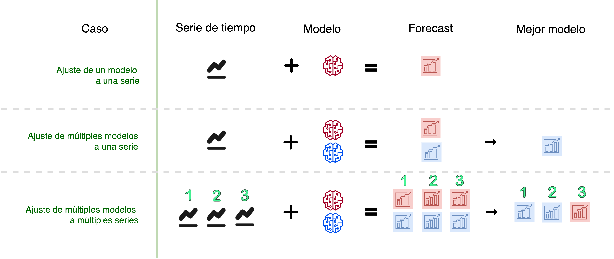
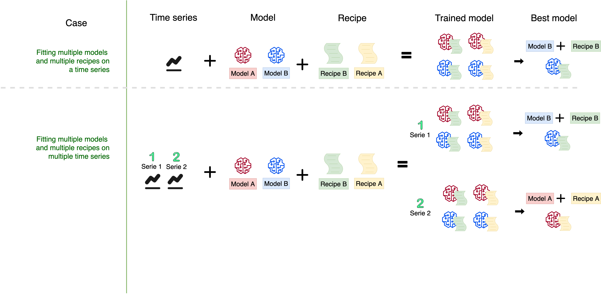

```{r setup, include=FALSE}
knitr::opts_chunk$set(warning = FALSE, 
                      message = FALSE, 
                      comment=FALSE)
```

```{r xaringan-themer, include=FALSE, warning=FALSE, eval=FALSE}
# Para generar el .css pero igual ya está generado, no correr de vuelta y editar el archivo directamente 
library(xaringanthemer)
style_mono_accent(
  title_slide_background_color	='#ffffff',
  title_slide_text_color = '#33407d',
  base_color = "#33407d",
  header_font_google = google_font("Josefin Sans"),
  text_font_google   = google_font("Montserrat", "300", "300i"),
  code_font_google   = google_font("Fira Mono")
)
```

```{css, echo=FALSE}
/* Table width = 100% max-width */
.remark-slide table{width: 100%;}

/* Change the background color to white for shaded rows (even rows) */
.remark-slide thead, .remark-slide tr:nth-child(2n) {
  background-color: white;
  .tfoot .td {background-color: white}
}

.bold-last-item > ul > li:last-of-type,
.bold-last-item > ol > li:last-of-type {font-weight: bold;}
```


```{r, include=FALSE, warning=FALSE}
xaringanExtra::use_progress_bar(color = "#0051BA", location = "top")
```

# Quiénes somos
.pull-left[
### Rafael Zambrano
🔮 **Data Scientist**
- Actuario
- Acá alguna descripción más extensa
]
.pull-right[
<br>
<br>
```{r, out.width='35%', fig.align='center', echo=FALSE}
knitr::include_graphics('images/imagen_b.jpeg')
```
]

.pull-left[
### Karina Bartolomé 
🔮 **Data Scientist**
- Economista
- Acá alguna descripción más extensa
]
.pull-right[
<br>
<br>
```{r, out.width='35%', fig.align='center', echo=FALSE}

```
]
---
# ¿Qué es #modeltime?

Es un ecosistema desarrollado por Matt Dancho para realizar análisis de series de tiempo mediante un enfoque ordenado (o Tidy) con #tidymodels. 

```{r, echo=FALSE, out.height='90%',out.width='90%',  fig.align='center'}
knitr::include_graphics('images/modeltime.png')
```

---

# Sknifedatar

#### Una extensión de modeltime

```{r, eval=FALSE}
install.packages('sknifedatar')
```
--
```{r, echo=FALSE, out.width='20%', out.height='20%', fig.align='center'}
knitr::include_graphics('images/sknifedatar.png')
```
Incluye: 
- **Funciones multifit**: Múltiples modelos en múltiples series de tiempo (sin datos de panel)
- **Workflowsets**: Worklowsets con modeltime
- **Workflowset multifit**: Worklowset en múltiples series (sin datos de panel)
- **Automagic tabs**: Función para generar automáticamente tabs en artículos distill o rmd
- **Ventanas móviles**: Partición de datos en ventanas móviles

---
# Agenda para hoy

```{r, echo=FALSE, out.width='30%', fig.align='center'}
knitr::include_graphics('https://media1.tenor.com/images/5998dc6b4576b29ba1d61a084f3d79d0/tenor.gif?itemid=5772115')
```

- **Introducción a modeltime**

- **Multifit**: Ajuste de múltiples modelos en múltiples series de tiempo

- **Workflowsets**: Ajuste de múltiples modelos y recetas de preprocesamiento sobre múltiples modelos

- **Extensión**: tabs en Distill / Rmd

---

# Librerías utilizadas

```{r, message=FALSE}
library(sknifedatar)
library(modeltime)
library(workflowsets)
library(rsample)
library(tidymodels)
library(tidyverse)
library(timetk)
library(anomalize) 
library(gt)
```

```{r, echo=FALSE, out.width='50%', fig.align='center'}
knitr::include_graphics('https://media1.tenor.com/images/591f5618423822e347cf9c9899bdf697/tenor.gif?itemid=9448505')
```

```{r, echo=FALSE}
xaringanExtra::use_panelset()
```

---

# Datos
**Consumo residencial de gas 4 estados de Estados Unidos, entre 1989 y 2020** 

--
```{r}
data <-  USgas::us_residential %>% rename(value=y) %>%  
  filter(state %in%  c('Nevada','Maine',
                       'Hawaii','West Virginia'))
```
--
```{r, echo=FALSE}
data %>% head(5) %>% kableExtra::kable(format = "html")
```

---

### Evolución y momentos anómalos
```{r, fig.width=10, fig.height=5, message=FALSE, eval=FALSE}
data %>% group_by(state) %>%
  plot_anomaly_diagnostics(date, value) 
```

```{r, fig.width=10, fig.height=5, message=FALSE, echo=FALSE}
data %>% group_by(state) %>%
  plot_anomaly_diagnostics(date, value, .anom_size = 1, .interactive=FALSE,
    .facet_ncol = 2, .max_anomalies = 0.05, .facet_scales = 'free_y') 
```

---
### Descomposición de series de tiempo

.panelset[
.panel[.panel-name[Hawaii]

```{r, message=FALSE, echo=FALSE, fig.width=10, fig.height=6}
nest_data <- data %>% nest(nested_column = -state)

nest_plots <- nest_data %>%
  mutate(ts_plots = map(nested_column, 
          ~  plot_stl_diagnostics(.x, 
              .date_var=date, 
              .value=value, 
              .frequency = 'auto',
              .trend = 'auto', 
              .interactive=FALSE,
              .feature_set = c("observed", "season", "trend", "remainder"))
          ))
nest_plots$ts_plots[[1]]
```
]

.panel[.panel-name[Maine]

```{r, echo=FALSE, fig.width=10, fig.height=6}
nest_plots$ts_plots[[2]]
```
]

.panel[.panel-name[Nevada]

```{r, echo=FALSE, fig.width=10, fig.height=6}
nest_plots$ts_plots[[3]]
```
]

.panel[.panel-name[West Virginia]

```{r, echo=FALSE, fig.width=10, fig.height=6}
nest_plots$ts_plots[[4]]
```
]
]
---
# Múltiples modelos y una serie


---
## Flujo de trabajo de modeltime

### Preparación de datos

* Se selecciona el estado de Hawaii

```{r, fig.height=3, fig.width=10}
data_hawaii <- data %>% 
  filter(state=='Hawaii')
```

--
* Particiona el dataset en train y test

```{r, fig.height=3, fig.width=10}
splits <- data_hawaii %>%  
  initial_time_split(prop = 0.8)
```

---
**Visualización de la partición**

```{r, fig.height=3, fig.width=10}
splits %>% 
  tk_time_series_cv_plan() %>%
  plot_time_series_cv_plan(date, value) 
```

---
**Receta**: Se crea una receta de preprocesamiento, incluye la fórmula a estimar y un paso adicional que añade variables en función de la fecha
```{r}
receta <- recipe(value ~ date, data = training(splits)) %>%
  
  step_timeseries_signature(date) %>% 
  
  step_rm(contains("iso"), 
          contains("minute"), 
          contains("hour"),
          contains("am.pm"), 
          contains("xts"), 
          contains("second"),
          date_index.num, 
          date_wday, 
          date_month)
```

```{r, echo=FALSE}
receta %>% prep() %>% juice() %>% head(2) %>% gt()
  
```

---
**Modelos**: Definición y ajuste de modelos sobre train

```{r, eval=FALSE}
# Modelo: Auto-ARIMA
m_autoarima <- arima_reg() %>% 
  set_engine('auto_arima') %>%  
  fit(value~date, data=training(splits))

# Modelo: exponential smoothing
m_exp_smoothing <- exp_smoothing() %>% 
  set_engine('ets') %>% 
  fit(value~date, data=training(splits))

# Workflow: prophet boosted
m_prophet_boost <- workflow() %>% 
  
  add_recipe(receta) %>% 
  
  add_model(
    prophet_boost(mode='regression') %>%
    set_engine("prophet_xgboost")
  ) %>% 
  
  fit(data = training(splits))
```

---
**Modeltimetable**

```{r, eval=FALSE}
modelos <- modeltime_table(m_autoarima,
                           m_exp_smoothing,
                           m_prophet_boost
                           )
```

```{r, echo=FALSE}
#saveRDS(modelos, 'modelos/modelos_hawaii.rds')
modelos <- readRDS('modelos/modelos_hawaii.rds')
```

--
```{r, echo=FALSE}
modelos %>% rmarkdown::paged_table(list(rows.print = 6))
```

---
**Calibración de modelos**: S everifica el rendimiento de los modelos sobre la partición de test.

```{r}
calibration_table  <- modelos %>% modeltime_calibrate(new_data = testing(splits))
```

--
* Verificación de metrias
```{r, eval=FALSE}
calibration_table %>% modeltime_accuracy()
```

```{r, echo=FALSE}
calibration_table %>% modeltime_accuracy() %>% 
  select(-.type) %>% 
  rmarkdown::paged_table(list(rows.print = 6))
```

---

* Forecasting

```{r}
forecast_series <- calibration_table %>% 
  modeltime_forecast(
    new_data    = testing(splits),
    actual_data = data_hawaii
  )
```

---

* Verificación visual

```{r, fig.height=6, fig.width=10}
forecast_series %>% 
  plot_modeltime_forecast(
    .legend_max_width     = 30, 
    .interactive          = FALSE,
    .conf_interval_alpha  = 0.2
  )
```

---
**Selección y reajuste de modelos sobre todo el conjunto de datos**

Se seleccionan 2 modelos y luego se reajustan ambos modelos en todos los datos (train + test)

```{r}
refit_tbl <- calibration_table %>%
  filter(.model_id %in% c(1,2)) %>% 
  modeltime_refit(data = data_hawaii)
```

--

Proyección

```{r}
forecast_final <- refit_tbl %>% 
  modeltime_forecast(
    actual_data = data_hawaii,
    h='2 years'
  )
```

---

**Visualización de la proyección a 2 años**

```{r, fig.height=6, fig.width=10}
forecast_final %>% 
  plot_modeltime_forecast(
    .legend_max_width = 30, 
    .interactive      = FALSE,
    .conf_interval_alpha = 0.2
)
```

---
# Múltiples modelos sobre múltiples series (no panel)

```{r, fig.align='center', echo=FALSE}

```

---
## Datos
```{r}
nest_data <- data %>% nest(nested_column = -state)
```
--
```{r, echo=FALSE, out.height='10%'}
reactable::reactable(nest_data, details = function(index) {
  data <- data[data$state == nest_data$state[index], c('date','value')] %>% 
    mutate(value = round(value, 2))
  htmltools::div(style = "padding: 10px", reactable::reactable(data, outlined = TRUE))
}, defaultPageSize=4) 
```

---
# Workflowsets en múltiples series

```{r, fig.align='center', echo=FALSE}

```


---

### Recetas
```{r}
# Receta base
recipe_base <- recipe(value~date, data=data_hawaii)

# Características según fecha
recipe_date_extrafeatures <- recipe_base %>% 
  step_date(date, features = c('month','year','quarter','semester'))

# Resagos
recipe_date_extrafeatures_lag <- recipe_date_extrafeatures %>% 
  step_lag(value, lag = 1:6) %>% 
  step_ts_impute(all_numeric(), period=365)

# Fourier
recipe_date_extrafeatures_fourier <-recipe_date_extrafeatures  %>% 
  step_fourier(date, period = 365/12, K = 1)
```

---
### Modelos
```{r}
# prophet_xgboost
prophet_boost <- prophet_boost(mode = 'regression') %>% 
  set_engine("prophet_xgboost")

# nnetar
nnetar <- nnetar_reg() %>% 
  set_engine("nnetar")

#auto_arima_xgboost
auto_arima_boost <- arima_boost() %>% 
  set_engine('auto_arima_xgboost')
```
---
### Workflowsets
```{r}
wfsets <- workflow_set(
  preproc = list(
    base                  = recipe_base,
    extrafeatures         = recipe_date_extrafeatures,
    extrafeatures_lag     = recipe_date_extrafeatures_lag,
    extrafeatures_fourier = recipe_date_extrafeatures_fourier
  ),
  models  = list(
    M_arima_boost       = auto_arima_boost,
    M_prophet_boost     = prophet_boost,
    M_nnetar            = nnetar
  ),
  cross   = TRUE
) 
```
---

### Ajuste de modelos
```{r, eval=FALSE}
wfs_multifit <- modeltime_wfs_multifit(serie = nest_data,
                                       .prop = 0.8,
                                       .wfs  = wfsets)
```

```{r, echo=FALSE}
# saveRDS(wfs_multifit, 'modelos/wfs_multifit.rds')
wfs_multifit <- readRDS('modelos/wfs_multifit.rds')
```

.panelset[
.panel[.panel-name[Hawaii]

```{r, message=FALSE, echo=FALSE, fig.width=10, fig.height=5}
plots <- wfs_multifit$models_accuracy %>% 
  select(-.model_id) %>%  
  rename(.model_id=.model_names) %>% mutate(.fit_model = '') %>% 
  group_by(name_serie) %>% 
  nest() %>% 
  mutate(plot = map(data, ~ modeltime_wfs_heatmap(., metric = 'rsq',
                                                 low_color = '#ece2f0',
                                                 high_color = '#1f356e'
                                                 ))) %>% 
  ungroup()

plots$plot[[1]]
```
]

.panel[.panel-name[Maine]

```{r, echo=FALSE, fig.width=10, fig.height=5}
plots$plot[[2]]
```
]

.panel[.panel-name[Nevada]

```{r, echo=FALSE, fig.width=10, fig.height=5}
plots$plot[[3]]
```
]

.panel[.panel-name[West Virginia]

```{r, echo=FALSE, fig.width=10, fig.height=5}
plots$plot[[4]]
```
]
]
---
### Proyecciones
```{r, message=FALSE, warning=FALSE}
wfs_multiforecast <- modeltime_wfs_multiforecast(
  wfs_multifit$table_time, .prop=0.8)
```

```{r, echo=FALSE, fig.height=6, fig.width=14, fig.align='center'}
wfs_multiforecast %>% 
  select(state, nested_forecast) %>% 
  unnest(nested_forecast) %>% 
  group_by(state) %>% 
  plot_modeltime_forecast(
    .legend_max_width = 40,
    .facet_ncol = 2, 
    .line_size = 0.5,
    .interactive = FALSE,
    .facet_scales = 'free_y',
    .title='Proyecciones') +
  theme(legend.position='bottom', legend.margin=margin())
```

---
### Selección del mejor modelo
```{r}
wfs_bests<- modeltime_wfs_multibestmodel(
  .table = wfs_multiforecast,
  .metric = "rsq",
  .minimize = FALSE
)
```

### Reentrenamiento para todos los datos

```{r, eval=FALSE, message=FALSE, warning=FALSE, comment=FALSE}
wfs_refit <- modeltime_wfs_multirefit(wfs_bests)
```

```{r, echo=FALSE}
#saveRDS(wfs_refit, 'modelos/wfs_refit.rds')
wfs_refit <- readRDS('modelos/wfs_refit.rds')
```

---
### Proyecciones a 12 meses

```{r, message=FALSE, warning=FALSE, comment=FALSE}
wfs_forecast <- modeltime_wfs_multiforecast(wfs_refit, 
                                            .h = "12 month")
```

```{r, echo=FALSE, fig.width=10, fig.height=6}
wfs_forecast %>% 
  select(state, nested_forecast) %>% 
  unnest(nested_forecast) %>% 
  group_by(state) %>% 
  plot_modeltime_forecast(
    .facet_ncol = 2, 
    .line_size = 0.5,
    .legend_max_width = 50,
    .interactive = FALSE,
    .facet_scales = 'free_y',
    .title='Proyecciones')+
  theme(legend.position='bottom')
```
---
# Automagic Tabs


---
## Qué es una tab?


---


---
## Generación de tabs de forma manual


---
## GIF


---
## Generación automatica de tabs

* Datos

* Dataframe anidado

---
## Generación de gráficos (imprimimos el dataframe andiado)


---
## Se muestra un grafico

```{r ,eval=FALSE}
nest_data %>% pluck("ts_plots",1)
```

---
## Inline ejemplo


---

```{r, out.width='30%', echo=FALSE, fig.align='center'}
knitr::include_graphics('https://media1.tenor.com/images/f6e068a5de7462f2dba479366e2b325d/tenor.gif?itemid=16536400')
```


## Contactos ✉

Karina Bartolome [](https://twitter.com/karbartolome) [](https://www.linkedin.com/in/karinabartolome/) [](https://github.com/karbartolome) [](https://karbartolome-blog.netlify.app/)


Rafael Zambrano [](https://twitter.com/rafa_zamr) [](https://www.linkedin.com/in/rafael-zambrano/) [](https://github.com/rafzamb) [](https://rafael-zambrano-blog-ds.netlify.app/)
